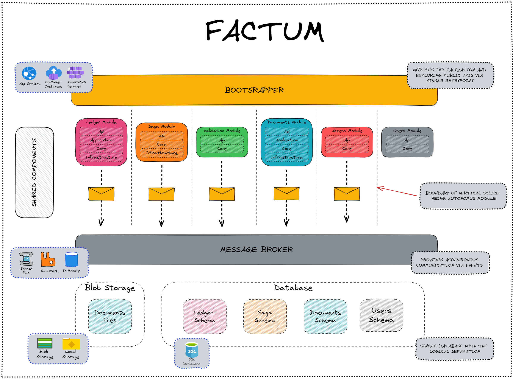

# Factum

## About

Factum is the sample document workflow based on blockchain. Application was built as Modular Monolith, written in .NET 6.0. Each module is an independent vertical slice with its custom architecture, and the overall integration between the modules is mostly based on the event-driven approach to achieve greater autonomy between the modules. 

## Starting the application
Start project and infrastructure using docker

```
docker-compose build
docker-compose up -d
```

Start API located under Bootstrapper project:

```
cd src\Bootstrapper\Factum.Bootstrapper
dotnet run
```

## Solution structure

### Bootstrapper

Web application responsible for initializing and starting all the modules - loading configurations, running DB migrations, exposing public APIs etc.

### Modules

**Autonomous modules** with the different set of responsibilities, highly decoupled from each other - there's no reference between the modules at all (such as shared projects for the common data contracts), and the synchronous communication & asynchronous integration (via events) is based on **local contracts** approach.

- Documents - managing the documents and access to them.
- Ledger - saving business-important operations in the blockchain structure.
- Validation - validation of newly created blockchain blocks.
- Saga - transactional handling for the creation and validation of new blockchain blocks.
- Users - managing the users/identity.

Each module contains its own HTTP requests definitions file (.rest) using REST Client extension.

### Saga

An example implementation of the Saga pattern using the [Chronicle](https://github.com/snatch-dev/Chronicle) package for transactional handling of business processes involving different modules.

### Ledger blockchain

Operation of adding documents and changing access is recorded in the form of ledger entries. Each entry contains a set of metadata of the operation.

Each block contains data about previous block and merkle tree root hash build from entries metadata.


## TODO

- Integration with [RabbitMq](https://www.rabbitmq.com/) message broker.
- Integration with [Azure Service Bus](https://azure.microsoft.com/en-us/services/service-bus/) message broker.
- Integration with [Azure Blob Storage](https://azure.microsoft.com/en-us/services/storage/blobs/) message broker.
- Integration with [Azure Key Vault](https://azure.microsoft.com/en-us/services/key-vault/) message broker.

## Additional resources
- [Modular Framework](https://github.com/devmentors/modular-framework) - project containing the shared components used in this project.
- [Inflow](https://github.com/devmentors/Inflow) - the project that inspired the Factum
